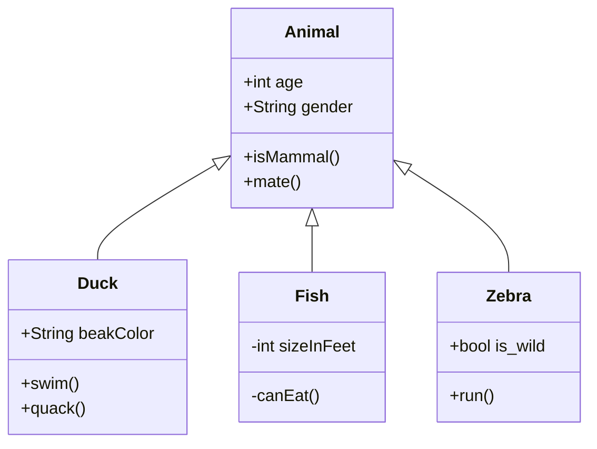
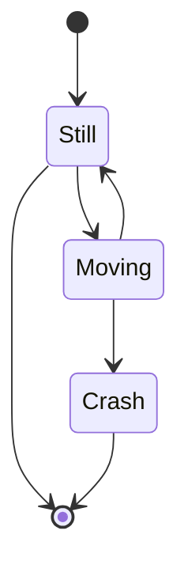

## What are Shortcodes?

HUGO shortcodes are not your usual keyboard combinations. They are a tool to design and structure your content. HUGO extends the standard Markdown syntax through “shortcodes”, which look like `{}` or ``.

You can use shortcodes within your Markdown content to add elements that would otherwise not be possible with Markdown alone.

Below you can find all the custom shortcodes available on the Developer Portal.
But first, let’s have a look at an example:

```
This is my regular text.

{}
This is additional content giving further details.
{}

Here is some more text.
```

The output for the shortcode example above looks like this:

---

This is my regular text.

{}
This is additional content giving further details.
{}

Here is some more text.

---

If you want to learn more about the concept of shortcodes, check out the [section about Shortcodes on the Gohugo.io website](https://gohugo.io/content-management/shortcodes/).

Find a list of all Developer Portal shortcodes below.

#### List of Custom Shortcodes

---

## Hightlight Text

### `info`

Break out of the normal text flow to give the reader more in-depth information.

```
{}
Add your text here.
{}
```

{}
Add your text here.
{}

### `note`

Break out of the normal text flow to give the reader additional information.

```
{}
Add your text here.
{}
```

{}
Add your text here.
{}

### `warning`

Break out of the normal text flow to warn the reader or point out common mistakes and misconceptions.

```
{}
Add your text here.
{}
```

{}
Add your text here.
{}

### `error`

Break out of the normal text flow to point out issues or problems.

```
{}
Add your text here.
{}
```

{}
Add your text here.
{}

### `success`

Break out of the normal text flow to show successful outcomes or congratulate the reader.

```
{}
Add your text here.
{}
```

{}
Add your text here.
{}

### `medal`

Break out of the normal text flow to show positive outcomes.

```
{}
Add your text here.
{}
```

{}
Add your text here.
{}

### `support`

Break out of the normal text flow to show support outcomes.

```
{}
Add your text here.
{}
```

{}
Add your text here.
{}

### `hint`

Add a subtle remark / hint directly in the flow with your text content.

```
{}
This is a subtle hint.
{}
```

Renders to:

{}
This is a subtle hint.
{}

---

## Structure

### `table`

This shortcode allows you to create tables in your markdown files with the simple structure. Every line contains one field. Blank lines separate table rows. No special prefix characters are needed. If you need a header row, add an optional parameter `header="true"` to the opening shortcode's tag. If you don't want to put data into the field, just put a dash “-“ or other character.

```

Column 1
Column 2
Column 3
Column 4

Column 1 content
Column 2 content
Column 3 content
Column 4 content

Just text
`var a = 1`
123.45
-

More text
`var b = 2`
789.1
A bit longer text. With punctuation marks

```

Renders to:


Column 1
Column 2
Column 3
Column 4

Column 1 content
Column 2 content
Column 3 content
Column 4 content

Just text
`var a = 1`
123.45
-

More text
`var b = 2`
789.1
A bit longer text. With punctuation marks


### `columns`

There are two ways on how information can be placed in a markdown file.

**Option 1. Distribute space of columns relatively**

Leverage the flexibility provided by this shortcode to align various items based on columns.

```

    {}
    {}
    ## Welcome to project X
    Project x is all about markdowns..
    {}

    {}
    
    {}
    {}

```

Renders to:

<div class="columnExplain">

{}

{}

#### Welcome to project X

Project x is all about markdowns..
{}

{}


{}

{}

</div>

{}
Borders around the columns are for demonstration purposes only and will not be displayed on your project page.
{}
<br>

Each `col` item is stacked next to each other horizontally keeping their actual size. If there is space left in the `column` item after this, each `col` can be grown to fill up that space. The growing factors are passed to each `col` item as a parameter. To make the middle column take up the most free space, it can be passed with a bigger share than the other two columns, like:

```

{}
{}

{}

{}

## Markdown everywhere

Let us talk about markdown..

{}
Works like magic, doesn't it?
{}
{}

{}

{}
{}

```

Renders to:

<div class="columnExplain">

{}
{}

{}

{}

#### Markdown everywhere

Let us talk about markdown..

{}
Works like magic, doesn't it?
{}
{}

{}

{}

{}

</div>

{}
Borders around the columns are for demonstration purposes only and will not be displayed on your project page.
{}
<br>

{}
**Known Bug:** When you put just a single paragraph into a `col` shortcode, it will not be rendered correctly. The fix for this is in progress by developers at Hugo and we will update it as soon as the fix is available.
{}

**Option 2. Enrich the column with specific data**

Enrich the columns with the data described below, like:

```

{}
{}

## Welcome to project X

Project x is all about markdowns..
{}

{}

{}
{}

```

Renders to:

<div class="columnExplain">

{}
{}

#### Welcome to project X

Project x is all about markdowns..
{}

{}

{}
{}

</div>

{}
Borders around the columns are for demonstration purposes only and will not be displayed on your project page.
{}
<br>

Specify the rows with some data:

Use _"width"_ or _"grow"_ to distribute the space each column is getting for the displayed information.

The data _"width"_ specifies how much px does the column get on the page.

**Example:**
```
width: 400px
```
The data _"grow"_ specifies how much the item will grow relative to the rest.

**Example:**
```
grow: 1
```
_"horizontal-align"_ is placing the item in the column in the specific location horizontally.

**Example:**
```
horizontal-align="right"
horizontal-align="left"
horizontal-align="center"
```
_"vertical-align"_ is placing the item in the column in the specific location vertically.

**Example:**
```
vertical-align="top"
vertical-align="bottom"
vertical-align="center"
```
### `accordion`

Create an accordion if you want to toggle between hiding and showing content. An accordion item requires the `title` parameter.

Example:

```



Some text...


Some text...


Some text...



```

Renders to:



Some text...


Some text...


Some text...



</br>

### `carousel`

Create an image carousel with optional titles for each image. The carousel can be customized via following parameters, added to the root of the short-code. All parameters are optional, falling back to their default values if not specified.

| Parameter Name   | description                                                                  | default value | example values   |
| ---------------- | ---------------------------------------------------------------------------- | :------------ | :--------------- |
| autoplayInterval | Specifies in milliseconds how fast the carousel should rotate automatically. | "5000"        | "10000", "false" |

The items themselves require the `src` parameter to be set to the image path. `title` is optional.

Example:

```






```

Renders to:






### `tabbed view`

Utilize this powerful shortcode to provide multiple alternative instructions pertaining to the same context.

```

{}

{}
**Windows** specific stuff...
{}

{}
_macOS_ specific stuff...
{}

{}

```

Renders to:

{}
{}
**Windows** specific stuff...
{}

{}
_macOS_ specific stuff...
{}
{}

If you have another tab view on the page that uses the same tab titles (here: `Java`, `PHP`, `JavaScript`)
the selection in one tab view will be applied to all others.

{}
If you have some render problems with using the syntax above, please replase % with <> as on the example below:
{}

```
{{ <tabs> }}
...
{{ </tabs> }}
```

{}
{}

```java
String foo = new String("Hello, World!");
```

{}
{}

```PHP
$foo = "Hello, World!"
```

{}
{}

```js
var foo = 'Hello, World!';
```

{}
{}


{}

```java
int bar = 42;
```

{}
{}

```PHP
$bar = 42
```

{}
{}

```js
var bar = 42;
```

{}


### `pages-by-tag`

List **all** pages with a single given tag or multiple tags adding them in a row. **Optional** parameter can be added as the **LAST parameter** to set number of visible list items. The tags must be defined in the pages’ front matter.

```md
{}
```

Renders to:

{}

### `pages-by-tag-tiles`

This shortcode has the same functionality as the `pages-by-tag` shortcode but displays the list of pages in `tiles` view

```md
{}
```

Renders to:

{}

### `list-of-links`

List-of-links shortcode allows you to create a list of links that you can click and copy. To add a link to the list insert
**a link text** followed by **an URL** separated by comma between the opening and closing tags of the shortcode. You can add both external and internal links.

```

Link to Google, https://google.com
Link to the Support page, /support/

```

Renders to:


Link to Google, https://google.com
Link to the Support page, /support/


{}
Every link should be on a separate line and every pair should be comma-separated.
{}

{}
If you want to show just link without text, add an URL twice.
{}

```

/support/, /support/
https://google.com, https://google.com

```

Renders to:


/support/, /support/
https://google.com, https://google.com


</br>

### `swagger-ui`

Generate a Swagger-UI from a Swagger API-specification from a remote or local file. The file name does not matter as long as the file contains a valid Swagger specification.

```
{}
```

```
{}
```

Example:

{}

### `var`

Use values defined in the current page’s front matter.

```md
---
myVariable: 'v1.2.0'
---

> The value of `myVariable` is {}.
```

> The value of `myVariable` is {}.

### `readfile`

Read a HTML file from another directory and render it within you markdown content.

```
{}
```

> 

---

## Visualize

### `diagram`

Define flowcharts, sequence diagrams and Gantt charts directly in your Markdown file as code.

```

   ... your diagram code goes here.

```

{}
Make sure to use the `<` brackets instead of `%` for this shortcode.
Otherwise, your diagram will be treated and rendered as Markdown instead of as a diagram!
{}

Please see the options below for details.

**Flowchart**

Define a directed graph / flowchart directly in your Markdown file.

For example, the following diagram definition:

```

graph LR
  A --- B
  B --> C
  B --> D[named node]
  D -- label --> E(round node)

```

... will give you this result:


graph LR
A --- B
B --> C
B --> D[named node]
D -- label --> E(round node)


For details on the syntax, please refer to https://mermaid-js.github.io/mermaid/#/flowchart.

**Sequence Diagram**

Add a sequence diagram to your page.

For example, the following diagram definition:

```

sequenceDiagram
  Alice->>John: Hello John, how are you?
  John-->>Alice: Great!

```

... will give you this result:


sequenceDiagram
Alice->>John: Hello John, how are you?
John-->>Alice: Great!


For details on the syntax, please refer to https://mermaid-js.github.io/mermaid/#/sequenceDiagram.

**Gantt Chart**

The third chart option you have is the Gantt chart.

For example, the following diagram definition:

```

gantt
  title A Gantt Diagram
  dateFormat  YYYY-MM-DD
  section Section
  A task           :a1, 2014-01-01, 30d
  Another task     :after a1  , 20d
  section Another
  Task in sec      :2014-01-12  , 12d
  another task     : 24d

```

... will give you this result:


gantt
title A Gantt Diagram
dateFormat YYYY-MM-DD
section Section
A task :a1, 2014-01-01, 30d
Another task :after a1 , 20d
section Another
Task in sec :2014-01-12 , 12d
another task : 24d


**Class diagram**

The class diagram is the main building block of object-oriented modeling. It is used for general conceptual modeling of the structure of the application, and for detailed modeling to translate the models into programming code. Class diagrams can also be used for data modeling. The classes in a class diagram represent both the main elements, interactions in the application, and the classes to be programmed.
For example, the following diagram definition.




For details on the syntax, please refer to https://mermaid.js.org/syntax/classDiagram.html

**State diagram**

Mermaid can render state diagrams. The syntax tries to be compliant with the syntax used in plantUml as this will make it easier for users to share diagrams between mermaid and plantUml.
For example, the following diagram definition.


For details on the syntax, please refer to https://mermaid.js.org/syntax/stateDiagram.html

### `image`

As we now support dark and light themes, the `image` shortcode gives you the possibility to specify different versions of the image for each theme. You can provide both dark and light version of the image to fit the theme and prevent color issues.

_Image src for light theme:_

- Specify the image src for light theme, for example: srcLight: "/some-your-folder/with-light-images/image.png"

_Image src for dark theme:_

- Specify the image src for dark theme, for example: srcDark: "/some-your-folder/with-dark-images/image.png"

_Width (Optional):_

- Specify the width of the image, for example: width="40px"; width="50%"; width="20em"; etc.

_Height (Optional):_

- Specify the height of the image, for example: height="50px"; height="75%"; height="30em"; etc.

_Position (Optional):_

- Specify the background position of the image, for example: position="center"; position="left"; position="right"; etc.

_ClassName (Optional):_

- Specify your custom ClassName of the image, for example: className="your-class-name"; className="custom-blue-border";

Example:

```

```

Renders to:



### `background color`

Due to the switch to a dark background of the Developer Portal some images have a transparent background. Due to this
some stuff might not be visible anymore. This shortcode provides your image/text with a background of your choice.

_Background color:_

- Specify the background color by name, for example: "white" or with hex value, for example: "#FFFFFF"

_Padding (Optional):_

- Specify the padding of the image in pixel, for example: padding="4px"

_Border radius (Optional):_

- Specify the border radius of the image in pixel, for example: border-radius="4px"

Example:

```
{}
  
{}
```

Renders to:

{}

{}

### `tiles`

You can add tiles to your page. Every tile has title, description and url (to navigate to a different page). Depending on the page width there might be 3, 2 or 1 tile in one row. If you need to open the tile link in a new tab, you can set the optional attribute `target="_blank"`.

For the individualization or recognition of a tile, you can also optionally add icons and/or images:

- To add **an icon**, add the `title-icon` parameter to a tile with **font awesome** icon you need, for example, `title-icon="fas fa-sitemap"`.

- To add **an image**, add the `image` parameter with the path to the image you would like to add, for example, `./images/some-img.png`.

```

  
    Lorem ipsum dolor sit amet, consetetur sadipscing elitr, sed diam nonumy eirmod tempor invidunt ut labore et dolore magna aliquyam erat, sed diam voluptua. At vero eos et accusam et justo duo dolores et ea rebum. Stet clita kasd gubergren, no sea takimata sanctus est Lorem ipsum dolor sit amet.
  
  
    Lorem ipsum dolor sit amet, consetetur sadipscing elitr.
  
  
    Lorem ipsum dolor sit amet, consetetur sadipscing elitr, sed diam nonumy eirmod tempor invidunt ut labore et dolore magna aliquyam erat, sed diam voluptua. At vero eos et accusam et justo duo dolores et ea rebum. Stet clita kasd gubergren, no sea takimata sanctus est Lorem ipsum dolor sit amet.
  
  
    Lorem ipsum dolor sit amet, consetetur sadipscing elitr, sed diam nonumy eirmod tempor invidunt ut labore et dolore magna aliquyam erat, sed diam voluptua. At vero eos et accusam et justo duo dolores et ea rebum. Stet clita kasd gubergren, no sea takimata sanctus est Lorem ipsum dolor sit amet.
  

```

Renders to:



Lorem ipsum dolor sit amet, consetetur sadipscing elitr, sed diam nonumy eirmod tempor invidunt ut labore et dolore magna aliquyam erat, sed diam voluptua. At vero eos et accusam et justo duo dolores et ea rebum. Stet clita kasd gubergren, no sea takimata sanctus est Lorem ipsum dolor sit amet.


Lorem ipsum dolor sit amet, consetetur sadipscing elitr.


Lorem ipsum dolor sit amet, consetetur sadipscing elitr, sed diam nonumy eirmod tempor invidunt ut labore et dolore magna aliquyam erat, sed diam voluptua. At vero eos et accusam et justo duo dolores et ea rebum. Stet clita kasd gubergren, no sea takimata sanctus est Lorem ipsum dolor sit amet.


Lorem ipsum dolor sit amet, consetetur sadipscing elitr, sed diam nonumy eirmod tempor invidunt ut labore et dolore magna aliquyam erat, sed diam voluptua. At vero eos et accusam et justo duo dolores et ea rebum. Stet clita kasd gubergren, no sea takimata sanctus est Lorem ipsum dolor sit amet.



### `font awesome icon`

You can place Font Awesome icons anywhere using a style prefix (`fa`, `fas`, `fab`) and the icon's name (e.g. `fa-envelope`). Browse through the available icons in the [Font Awesome Gallery](https://fontawesome.com/icons?d=gallery&m=free). Once on the Font Awesome page for a specific icon, for example the page for the [envelope](https://fontawesome.com/icons/envelope?style=solid), copy the `className` and paste into the shortcode. For more details check out [Basic Use](https://fontawesome.com/how-to-use/on-the-web/referencing-icons/basic-use).

{}
Notice that the free filter is enabled, as only **free icons** from **Font Awesome 6** are available.
{}

For example:

```

```

Renders to: </br>


**Additional Styling Options**

While the basic way to embed an icon is simple, we also provide styling for things like sizing icons, coloring and setting a gap.

You can increase or decrease the **icon's size** by setting a size `className` (`fa-xs`, `fa-sm`, `fa-lg`, `fa-2x`, `fa-3x`, `fa-5x`, `fa-7x`, `fa-10x`). For more details please go to [Sizing Icons](https://fontawesome.com/how-to-use/on-the-web/styling/sizing-icons).

For example:

```

```

Renders to: </br>
 
</br>

You can also set any **color** you need in HEX (e.g., `#fafafa`, etc.), RGB/RGBA (e.g., `rgb(250, 250, 250)`, `rgba(250, 250, 250, 0.5)`, etc.) or in colors **keywords** (e.g., `red`, `blue`, `green`, etc.)

For example:

```

```

Renders to: </br>
</br>

If you also need to set some **gap** from the top/right/bottom/left side of an icon, you can easily do that by setting params `gapTop`, `gapRight`, `gapBottom`, `gapLeft` in any of css units: `px`, `%`, `em`, `rem`. You can set one, two or all of them to have gaps from sides you need.

For example:

```
 Some text.
```

Renders to: </br>
 Some text.

### `button`

This shortcode allows you to add customizable buttons to your page. It can be a plain **button** if you need to perform an action, or a **link** to redirect to another url or download a file.

**Option 1. To add a plain button** insert the next element to your document:

```
Button label

```

Renders to:

Button label
</br>
</br>

To make your button functional add any HTML attributes you need, for example:

```
Launch modal

```

</br>

**Option 2. To get a link** add the `href` attribute to the shortcode.\*\*

To redirect to another page or resource:

```
Go to Google

```

Renders to:

Go to Google

</br>
</br>

To download the file:

```
Download Two Factor Authentication Guide

```

Renders to:

Download

</br>
</br>

{}
By default links are opened in a new tab as they have `target="_blank"` attribute
{}

**Additional Styling Options**

We also allow you to use button modifiers such as “small” or “transparent”. Just add the parameter called “modifiers” to your shortcode and set the value to “small” or “transparent”, or both comma-separated, as in the example below:

```
Go to Google

```

Renders to:

Go to Google

</br>
</br>

or

```
Run action

```

Renders to:

Run action

</br>
</br>

You can also add a font awesome icon into your button using the [fa-icon](#font-awesome-icon) shortcode

```
Download
```

Renders to:

Download

</br>
</br>

### `contact-card`

This shortcode allows you to display information about contact persons on your team. You need to provide the person's full name, role, and area/department at BMW. Optionally it's possible to add a photo by providing a path to the directory with the picture.

Example:
```

  
  
  
  

```
Renders to:








<br/>

#### What's Next?

Explore our Broken Link Checker to ensure all your hyperlinks are working correctly. Find all the information you need to setup and run the BLC in our article [Find Broken Links.](./writers-guide-broken-links)
